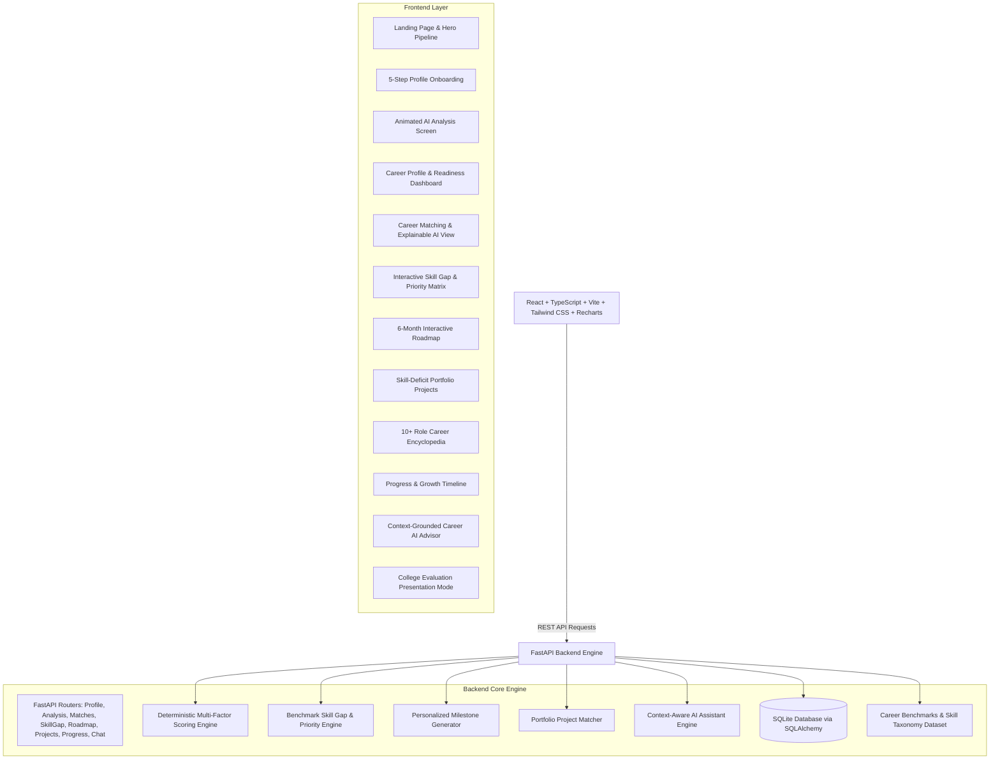

# AI Career Navigator

> **"Know where you are. Discover where you belong. Build your path."**  
> *"Your skills. Your potential. Your roadmap."*

An intelligent, interactive **AI Career Intelligence Platform** designed primarily for college students and early-career learners. The platform moves beyond generic dashboards to deliver explainable career matching, interactive skill gap analysis, personalized roadmaps, portfolio project recommendations, progress tracking, an intelligent context-aware career AI advisor, and dedicated demo/presentation modes.

---

## 🌟 Key Highlights & Differentiators

* **Explainable AI (XAI) Recommendation Engine**: Transparently decomposes composite match scores (0–100%) into 5 clear factors: Technical & AI Skills (35%), Practical Projects (25%), Domain Interests (20%), Academic Performance (10%), and Verified Certifications (10%).
* **Benchmark Skill Gap Matrix**: Dynamically benchmarks candidate proficiencies against 10+ tech roles (Data Scientist, Data Analyst, ML Engineer, AI Engineer, Data Engineer, Software Engineer, Business Analyst, AI Researcher). Classifies skills into `Strong`, `Improve`, and `Major Gap`, and ranks learning priorities (`HIGH`, `MEDIUM`, `LOW`) with domain-specific rationales.
* **Dynamic 6-Month Personal Roadmap with Curated Resources**: Synthesizes month-by-month learning objectives, recommended hands-on builds, study hour estimates, and direct links to curated high-quality tutorials (Interactive Courses, Official Docs, Video Masterclasses, LeetCode/Kaggle Practice Labs).
* **Multi-Theme & Palette Customization**: Rich aesthetic theme engine featuring 5 curated color palettes (Emerald Matrix, Modern Indigo, Ocean Cloud, Sunset Crimson, Golden Amber) with Dark/Light/System mode toggles, persistent storage, and gamified student XP tracking (+250 XP per milestone).
* **Gap-Closing Portfolio Projects**: Curates end-to-end full-stack projects specifically targeting detected skill deficits, featuring portfolio star ratings (1–5 stars) and 5-step architecture blueprints.
* **Context-Grounded AI Career Advisor**: Floating and slide-over AI coach that factors in the candidate's exact skills, CGPA, target role, and active roadmap stage. Works out-of-the-box with an intelligent semantic fallback engine (zero external API keys required) and supports optional OpenAI/Gemini LLM integrations.
* **College Presentation & Demo Modes**: One-click "Try Demo" loads rich sample profile *Alex Student* instantly. Built-in "Presentation Mode" provides a clean 5-slide guided walkthrough for college faculty reviews, hackathon demos, and internship recruiters.

---

## 🏗️ System Architecture



---

## 📐 AI Recommendation & Scoring Methodology

The recommendation engine calculates a normalized compatibility score $S \in [0, 100]$ between a student's profile and each career benchmark using the following formulation:

$$\text{Career Match Score} = (S_{\text{tech}} \times 0.35) + (S_{\text{proj}} \times 0.25) + (S_{\text{int}} \times 0.20) + (S_{\text{acad}} \times 0.10) + (S_{\text{cert}} \times 0.10)$$

### Factor Breakdown:
1. **Technical & AI Skills ($S_{\text{tech}}$, 35% weight)**:
   $$\text{Ratio} = \frac{\sum_{i} \min(1.0, \frac{\text{UserLevel}_i}{\text{ReqLevel}_i}) \times \text{ReqLevel}_i}{\sum_i \text{ReqLevel}_i}$$
2. **Practical Projects ($S_{\text{proj}}$, 25% weight)**:
   Evaluates project quantity, complexity, and technology stack overlap against role core technologies.
3. **Domain Interests ($S_{\text{int}}$, 20% weight)**:
   Measures Jaccard and semantic overlap between candidate interests and role domain keywords.
4. **Academic Performance ($S_{\text{acad}}$, 10% weight)**:
   Normalizes candidate CGPA on a standard scale.
5. **Verified Certifications ($S_{\text{cert}}$, 10% weight)**:
   Measures verified credentials aligned with the target role.

---

## 💻 Tech Stack

### Frontend:
* **Framework**: React 18/19 with TypeScript
* **Build Tool**: Vite
* **Styling**: Tailwind CSS (Tailwind v4 with `@tailwindcss/vite`), Vanilla CSS tokens, Bespoke Glassmorphism
* **Data Visualization**: Recharts (RadialBarChart, RadarChart, BarChart, AreaChart)
* **Icons**: Lucide React
* **Microinteractions**: Canvas-Confetti

### Backend:
* **Framework**: Python 3.10+ with FastAPI
* **Server**: Uvicorn (ASGI)
* **Database / ORM**: SQLite + SQLAlchemy 2.0
* **Data Validation**: Pydantic v2
* **AI & LLM Integration**: Modular context advisor (Zero-key semantic engine + optional OpenAI/Gemini integration)

---

## 🗄️ Database Schema

* `profiles`: Candidate demographics, degree, semester, CGPA, target career, and readiness score.
* `skills`: Normalized candidate proficiencies (0–100%) categorized by Technical and AI/Data domains.
* `projects`: Candidate practical projects, descriptions, tech stacks, and difficulty levels.
* `certifications`: Verified credentials, issuers, and years.
* `interests`: Candidate interest domains.
* `milestone_progress`: Checkbox states for personalized 6-month roadmap stages.
* `progress_snapshots`: Historical monthly readiness scores and skills mastered timeline.

---

## 🚀 API Endpoints

| Method | Endpoint | Description |
|---|---|---|
| `POST` | `/api/profile` | Create or update candidate profile |
| `GET` | `/api/profile/{id}` | Retrieve candidate profile |
| `POST` | `/api/profile/demo` | Load pre-seeded *Alex Student* demo profile |
| `POST` | `/api/analyze-career` | Execute complete career intelligence pipeline |
| `GET` | `/api/career-matches/{id}` | Get ranked role matches with XAI breakdown |
| `GET` | `/api/skill-gap/{id}?career={role}` | Benchmark skill gap comparison for target role |
| `GET` | `/api/roadmap/{id}?career={role}` | Personalized 6-month roadmap with milestone states |
| `POST` | `/api/roadmap/toggle-milestone` | Toggle milestone completion state |
| `GET` | `/api/projects/recommendations/{id}?career={role}` | Gap-targeted portfolio project recommendations |
| `GET` | `/api/careers` | Catalog of 10+ tech/data role benchmarks |
| `GET` | `/api/progress/{id}` | Progress statistics and growth timeline |
| `POST` | `/api/ai/chat` | Context-grounded AI Career Advisor chat endpoint |

---

## 📦 Getting Started & Running Locally

### Prerequisites:
* Python 3.10 or higher
* Node.js v18 or higher (tested on Node v24)
* npm

### 1. Start Backend:
```bash
cd backend
python -m pip install -r requirements.txt
python -m uvicorn app.main:app --host 127.0.0.1 --port 8000 --reload
```
*Backend runs on `http://127.0.0.1:8000` (Swagger UI at `http://127.0.0.1:8000/docs`).*

### 2. Start Frontend:
```bash
cd frontend
npm install
npm run dev
```
*Frontend runs on `http://127.0.0.1:5173`.*

---

## 🔑 Environment Variables (Optional)

Create a `.env` file in the `backend/` directory if you wish to enable external LLMs:

```env
# Optional external LLM providers (Application works 100% without them via built-in semantic engine)
OPENAI_API_KEY=sk-...
GEMINI_API_KEY=...
DATABASE_URL=sqlite:///./career_navigator.db
```

---

## 🗺️ Future Extensions

* [ ] Resume PDF parsing & automatic skill extraction
* [ ] GitHub & LinkedIn profile portfolio scraping
* [ ] Real-time job market scrapers & live hiring trend analytics
* [ ] AI-driven voice & text mock technical interviews
* [ ] Automated coding challenge assessments

---

## 📄 License

MIT License. Designed for students, educators, and early-career software/AI professionals.

